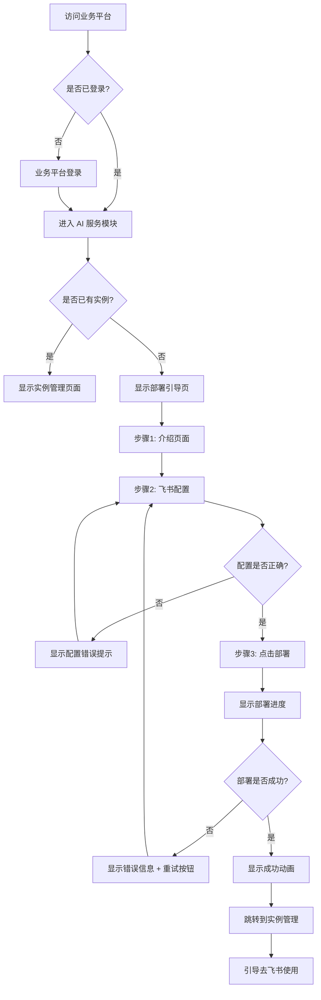
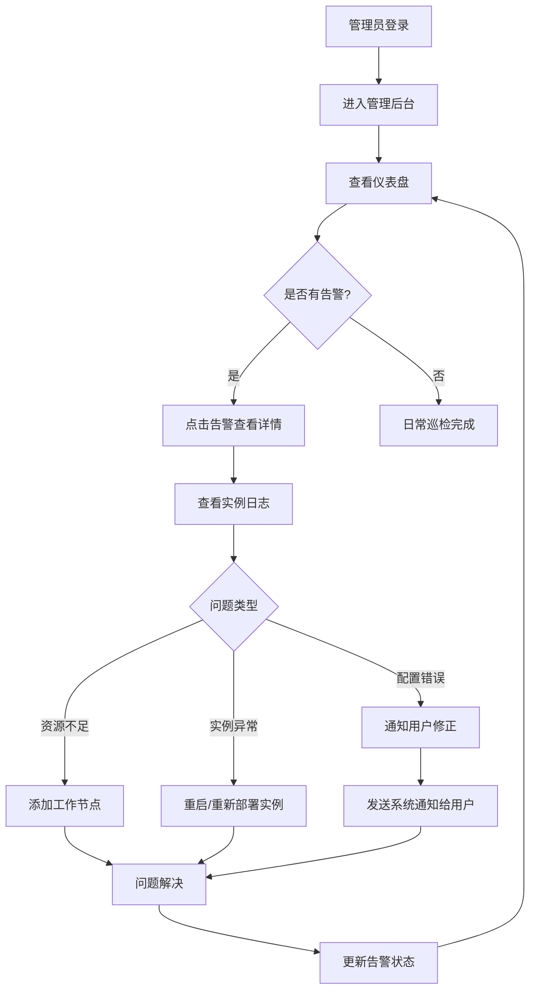

# UX Design Specification - saas-openclaw

**Author:** Gowa
**Date:** 2026-03-04

---

## Executive Summary

### Project Vision

OpenClaw 一键部署平台，让普通用户通过飞书轻松拥有自己的 AI Agent 实例。核心价值主张：**"点一下就能跑起来了"**。

从"需要技术背景的复杂本地部署"变成"点一下就能跑起来"，通过容器化 + 托管 + 社交平台集成，让普通用户也能使用 AI Agent 的强大能力。

### Target Users

**主要用户画像：李明**
- 年龄：32岁
- 职业：售前解决方案工程师
- 技术背景：非技术背景，会使用飞书等办公软件
- 需求：需要 AI 帮助编写方案、整理信息
- 痛点：听说 OpenClaw 很强大，但不会部署，被技术门槛挡住
- 期望：点一下就能用，不需要学习 Docker、配置等技术

**次要用户画像：王运维（平台管理员）**
- 年龄：28岁
- 职业：SaaS 平台运维工程师
- 技术背景：熟悉 Docker、容器编排
- 需求：监控平台运行状态、处理用户问题
- 痛点：需要快速定位和解决问题

### Key Design Challenges

| 挑战 | 描述 | 优先级 |
|------|------|--------|
| **信任建立** | 用户需要信任平台能安全管理他们的 AI Agent | 高 |
| **配置简化** | 飞书 App ID/Secret 配置对非技术用户陌生 | 高 |
| **进度感知** | 2-3分钟部署等待需要清晰反馈 | 中 |
| **首次成功引导** | 部署成功后引导用户在飞书中使用 | 高 |

### Design Opportunities

| 机会 | 描述 | 预期效果 |
|------|------|----------|
| **零配置体验** | 自动化减少用户输入，最小化配置步骤 | 降低使用门槛 |
| **分步引导** | 将复杂流程拆解为简单可执行步骤 | 降低认知负担 |
| **实时进度反馈** | 部署过程展示清晰进度和预计时间 | 建立用户信任 |
| **即时可用** | 部署完成后直接提供飞书使用入口 | 缩短价值实现时间 |

---

## Core User Experience

### Defining Experience

**核心用户行为定义：**

saas-openclaw 有两个核心场景：

| 场景 | 平台 | 行为 | 频率 | 重要性 |
|------|------|------|------|--------|
| **部署场景** | 业务平台（Web） | 一键部署 OpenClaw 实例 | 低频 | 决定用户能否开始 |
| **使用场景** | 飞书 | 与 OpenClaw 对话完成任务 | 高频 | 决定用户是否继续 |

**最关键交互：一键部署流程**

这是用户与产品的第一次深度交互，直接影响产品价值主张"点一下就能跑起来"的实现。

### Platform Strategy

| 平台 | 用途 | 优先级 | 交互方式 |
|------|------|--------|----------|
| **Web（业务平台）** | 部署管理、配置管理 | MVP 必须 | 鼠标 + 键盘（桌面优先） |
| **飞书桌面端** | AI Agent 对话 | MVP 必须 | 键盘输入 |
| **飞书移动端** | AI Agent 对话 | MVP 必须 | 触屏 + 语音输入 |

**设计原则：** 业务平台专注"部署体验"，飞书专注"对话体验"。

### Effortless Interactions

**无摩擦设计目标：**

| 用户痛点 | 无摩擦解决方案 |
|---------|---------------|
| 需要学习 Docker 概念 | 用户无需知道什么是 Docker |
| 需要配置环境变量 | 系统自动配置，用户只需填写必要信息 |
| 部署失败不知原因 | 清晰的错误提示和一键重试 |
| 不知部署进度 | 实时进度条 + 预计剩余时间 |
| 部署成功不知道怎么用 | 自动跳转到飞书使用教程 |

**自动发生的操作：**
1. 飞书应用配置实时校验
2. 实例健康检查
3. 配置自动备份

### Critical Success Moments

| 时刻 | 用户感受 | 设计目标 |
|------|----------|----------|
| 首次看到部署按钮 | "这看起来很简单" | 视觉清晰，操作明确 |
| 点击部署后 | "我知道发生了什么" | 实时进度反馈 |
| 部署成功 | "我做到了！" | 成功确认 + 下一步引导 |
| 飞书首次对话 | "它真的有用！" | 即时响应，展示价值 |

**决定成败的关键流程：**
1. 部署流程 - 如果失败，用户流失
2. 飞书配置流程 - 如果配置错误，无法使用

### Experience Principles

基于以上分析，确立以下体验原则：

1. **极简优先** - 每个界面只做一件事，减少用户决策负担
2. **即时反馈** - 任何操作都有明确的视觉响应
3. **错误友好** - 错误不是终点，提供清晰的恢复路径
4. **价值可见** - 用户每完成一步，都能看到离目标更近

---

## Desired Emotional Response

### Primary Emotional Goals

**核心情感：赋能感**

用户应该感到"我也能用 AI Agent"——从"被技术门槛挡住"到"我做到了"的转变。

**支持情感：**

| 情感 | 为什么重要 | 触发时机 |
|------|-----------|----------|
| **信任感** | 用户需要相信平台能安全管理他们的 AI Agent | 首次访问、输入敏感信息 |
| **成就感** | 用户成功完成部署后的满足感 | 部署成功、首次对话成功 |
| **掌控感** | 用户感觉一切都在掌控中 | 查看进度、管理配置 |

### Emotional Journey Mapping

| 阶段 | 用户行为 | 期望情感 | 避免情感 |
|------|----------|----------|----------|
| 发现阶段 | 听说产品、访问官网 | 好奇、期待 | 怀疑、困惑 |
| 准备阶段 | 阅读教程、准备配置 | 自信、清晰 | 焦虑、迷茫 |
| 部署阶段 | 点击启动、等待完成 | 安心、信任 | 不安、焦急 |
| 成功阶段 | 看到成功提示 | 成就感、惊喜 | 怀疑"真的好了吗" |
| 使用阶段 | 飞书中对话 | 满足感、效率感 | 失望、挫败 |
| 问题阶段 | 部署失败、配置错误 | 被支持感、有希望 | 无助、愤怒 |

### Micro-Emotions

| 微情感对 | 重要性 | 设计策略 |
|---------|--------|----------|
| 自信 vs 困惑 | ⭐⭐⭐⭐⭐ 关键 | 每步都有清晰指引，配置有实时校验 |
| 信任 vs 怀疑 | ⭐⭐⭐⭐⭐ 关键 | 专业视觉设计、安全认证标识、进度透明 |
| 成就 vs 挫败 | ⭐⭐⭐⭐⭐ 关键 | 成功时刻庆祝、失败有恢复路径 |
| 安心 vs 焦虑 | ⭐⭐⭐⭐ 重要 | 实时进度、预计时间、健康检查 |
| 惊喜 vs 平淡 | ⭐⭐⭐ 加分 | 部署速度超出预期、使用体验流畅 |

### Design Implications

| 情感目标 | UX 设计策略 |
|---------|-------------|
| 赋能感 | 简化流程、自动化配置、最小化用户输入 |
| 信任感 | 专业视觉、安全标识、进度透明、错误友好 |
| 成就感 | 成功动画、明确的完成状态、下一步引导 |
| 掌控感 | 实时进度条、状态可见、可随时查看/修改配置 |

**情感触发点设计：**

1. 首次成功部署 → 弹出庆祝动画 + "恭喜！你的 AI Agent 已就绪"
2. 飞书首次对话 → OpenClaw 主动发送欢迎消息
3. 问题恢复成功 → "问题已解决，你的 AI Agent 已恢复运行"

### Emotional Design Principles

基于情感目标，确立以下情感设计原则：

1. **赋能优先** - 每个设计决策都要问"这是否让用户感到更有能力？"
2. **透明建立信任** - 进度可见、状态清晰、错误可理解
3. **庆祝成功** - 不放过任何让用户感到成就的机会
4. **失败有希望** - 任何错误都要提供清晰的恢复路径

---

## UX Pattern Analysis & Inspiration

### Inspiring Products Analysis

**飞书 - 用户已熟悉的工作平台**
- 导航简洁清晰，功能分类合理
- 应用配置分步骤，每步有清晰说明
- 操作后立即有状态反馈
- 错误信息清晰，有解决建议

**Vercel - 开发者友好的部署体验**
- 一键部署，极简体验
- 实时日志流，清晰的进度阶段
- 明确的成功动画和访问入口

**Notion - 优雅的首次体验**
- 分步骤引导，每步只做一件事
- 友好的空状态提示
- 简洁、专业、信任感强的视觉设计

**Railway - 现代化 PaaS 部署**
- 图形化的部署状态和资源使用
- 一键部署模板应用
- 部署过程实时日志展示

### Transferable UX Patterns

**导航模式：**
- 左侧导航 + 主内容区（飞书）→ 业务平台整体布局
- 单页向导式流程（Notion）→ 部署配置流程

**交互模式：**
- 一键启动 + 实时进度（Vercel/Railway）→ 部署流程
- 分步表单 + 进度指示器 → 飞书应用配置
- 成功动画 + 下一步引导（Notion）→ 部署成功后

**视觉模式：**
- 简洁专业的配色（Notion/Linear）→ 建立信任感
- 清晰的状态指示（Railway）→ 实例状态展示
- 友好的插图/图标（飞书）→ 空状态和引导页

### Anti-Patterns to Avoid

| 反模式 | 问题 | 替代方案 |
|--------|------|----------|
| 技术术语堆砌 | 非技术用户无法理解 | 通俗语言，隐藏技术细节 |
| 长表单一次提交 | 用户容易出错 | 分步表单，逐步验证 |
| 模糊的进度提示 | 用户焦虑 | 明确阶段 + 预计时间 |
| 错误只显示代码 | 用户不知如何修复 | 错误描述 + 解决方案 |
| 成功后无引导 | 用户不知下一步 | 明确的下一步行动 |

### Design Inspiration Strategy

**采用：**
- 一键部署模式（Vercel）- 支持"点一下就能跑起来"的核心体验
- 分步向导流程（Notion）- 符合非技术用户的认知习惯
- 实时进度反馈（Railway）- 建立信任，减少焦虑

**适配：**
- 飞书导航风格 - 用户已熟悉，降低学习成本
- Railway 状态可视化 - 简化为用户需要的核心信息

**避免：**
- 技术术语展示 - 与赋能感目标冲突
- 复杂的配置选项 - 与极简原则冲突

---

## Design System Foundation

### Design System Choice

**选择方案：Ant Design + 自定义主题**

基于项目需求和用户分析，选择 Ant Design 作为 UI 组件库基础，配合自定义主题实现品牌差异化。

### Rationale for Selection

| 决策因素 | 选择理由 |
|---------|---------|
| 用户熟悉度 | 目标用户日常使用企业应用，对Ant Design风格已有认知 |
| 开发效率 | 组件丰富，文档完善，适合MVP快速开发 |
| 中文生态 | 完善的中文文档和社区支持 |
| 技术匹配 | TypeScript 原生支持，与项目技术栈匹配 |
| 可定制性 | 支持主题定制，可调整品牌风格 |

### Implementation Approach

**技术栈组合：**
- React + TypeScript
- Ant Design 5.x（最新版本，支持CSS-in-JS）
- 自定义主题配置

**主题定制要点：**
- 色彩体系：简化为主，采用专业简洁的配色
- 圆角：统一为 6px，现代感
- 字体：系统默认字体，保证阅读体验
- 间距：统一的 4px 基础单位

### Customization Strategy

**品牌差异化定制：**

1. **色彩调整**
   - 主色调：专业的蓝色系（信任感）
   - 成功色：绿色（成就感）
   - 警告/错误：红色（清晰的错误提示）

2. **组件精简**
   - 仅使用必要的核心组件
   - 隐藏复杂的技术配置选项
   - 自定义空状态和引导页

3. **文案优化**
   - 替换技术术语为用户友好语言
   - 简化按钮和表单标签
   - 添加引导性文案

4. **状态可视化**
   - 自定义部署进度组件
   - 实例状态指示器
   - 友好的错误状态展示

---

## Defining Experience

### The Core Interaction

**定义性体验：一键部署 OpenClaw 实例**

用户会如何向朋友描述："你点一下，然后就能在飞书里用 AI Agent 了！"

这是产品价值主张"点一下就能跑起来"的直接体现。

### User Mental Model

| 方面 | 用户认知 |
|------|----------|
| 当前解决方案 | 本地部署太复杂，需要技术背景，放弃使用 |
| 期望 | 像 SaaS 应用一样，点一下就能用 |
| 心智模型 | "我只需要提供飞书账号，剩下的自动完成" |
| 困惑点 | App ID/Secret 是什么？在哪里获取？ |

### Success Criteria

| 标准 | 描述 | 测量方式 |
|------|------|----------|
| 即时感 | 用户点击后立即有反馈 | 点击后 < 1秒 显示进度 |
| 掌控感 | 用户知道正在发生什么 | 清晰的阶段指示 + 预计时间 |
| 成功感 | 用户明确知道何时完成 | 成功动画 + 明确的完成状态 |
| 可恢复 | 失败时有清晰的恢复路径 | 错误原因 + 一键重试 |

### Experience Mechanics

**部署流程阶段：**

| 阶段 | 耗时 | 用户看到 | 系统操作 |
|------|------|----------|----------|
| 验证配置 | 5-10秒 | "正在验证配置..." | 校验飞书配置 |
| 创建实例 | 30-60秒 | "正在创建实例...预计还需2分钟" | 分配资源、拉取镜像 |
| 启动服务 | 60-120秒 | "正在启动服务...预计还需1分钟" | 启动容器、健康检查 |
| 就绪 | 完成 | "🎉 你的 AI Agent 已就绪！" | 显示成功状态 |

**反馈机制：**

| 状态 | 视觉反馈 | 信息反馈 |
|------|----------|----------|
| 进行中 | 进度条动画 + 阶段名称 | 预计剩余时间 |
| 成功 | 庆祝动画 + 绿色勾 | "你的 AI Agent 已就绪" |
| 失败 | 错误图标 + 红色提示 | 错误原因 + 解决方案 |

### Novel UX Patterns

**创新点：飞书配置引导**

用户不熟悉飞书开放平台的概念，需要设计分步图文教程：

1. 跳转到飞书开放平台（新窗口打开）
2. 创建企业自建应用（带截图指引）
3. 复制 App ID 和 Secret（高亮显示位置）
4. 返回平台粘贴（已填写的值保留）

**成熟模式采用：**
- 一键启动模式（参考 Vercel）
- 实时进度反馈（参考 macOS 安装进度）
- 成功确认动画（参考 Notion）

---

## Visual Design Foundation

### Color System

**主色彩方案：**

| 类型 | 颜色 | 色值 | 用途 |
|------|------|------|------|
| 主色 | 专业蓝 | `#1677FF` | 主要按钮、链接、强调 |
| 成功色 | 翠绿 | `#52C41A` | 成功状态、完成提示 |
| 警告色 | 橙黄 | `#FAAD14` | 警告提示 |
| 错误色 | 红色 | `#FF4D4F` | 错误状态、失败提示 |

**中性色系：**

| 类型 | 色值 | 用途 |
|------|------|------|
| 深灰 | `#1F1F1F` | 标题、重要文字 |
| 中灰 | `#666666` | 正文文字 |
| 浅灰 | `#F5F5F5` | 背景色 |
| 边框灰 | `#D9D9D9` | 边框、分隔线 |

### Typography System

**字体选择：**
- 主字体：系统默认字体
- 中文：PingFang SC / Microsoft YaHei
- 等宽：SF Mono / Monaco（代码、ID）

**字号层级：**

| 层级 | 大小 | 行高 | 字重 | 用途 |
|------|------|------|------|------|
| H1 | 24px | 32px | 600 | 页面标题 |
| H2 | 20px | 28px | 600 | 区块标题 |
| H3 | 16px | 24px | 600 | 小标题 |
| Body | 14px | 22px | 400 | 正文、表单 |
| Caption | 12px | 20px | 400 | 辅助说明 |

### Spacing & Layout Foundation

**间距系统：**

| 名称 | 数值 | 用途 |
|------|------|------|
| xs | 4px | 紧凑间距 |
| sm | 8px | 元素内间距 |
| md | 16px | 组件间距 |
| lg | 24px | 区块间距 |
| xl | 32px | 页面边距 |

**布局参数：**
- 最大内容宽度：1200px
- 侧边导航宽度：200px
- 基础单位：4px

### Accessibility Considerations

| 方面 | 标准 | 实施方案 |
|------|------|----------|
| 色彩对比度 | WCAG AA (4.5:1) | 文字与背景对比度满足标准 |
| 焦点状态 | 键盘导航可见 | 明显的焦点边框样式 |
| 字号 | 最小 12px | 所有正文 ≥ 14px |
| 点击区域 | 最小 44x44px | 按钮满足最小点击区域 |

---

## Design Direction Decision

### Design Directions Explored

探索了三个设计方向：

| 方向 | 特点 | 信息密度 | 适用场景 |
|------|------|----------|----------|
| **方向 1: 标准企业风格** | 左侧导航 + 主内容区 | 中等 | 用户熟悉的布局，适合日常管理 |
| **方向 2: 向导式聚焦** | 单列居中 + 分步引导 | 低 | 首次部署体验，降低认知负担 |
| **方向 3: 卡片式仪表盘** | 卡片组织 + 状态一览 | 高 | 管理多个实例，快速了解状态 |

**设计方向展示文件：** `ux-design-directions.html`

### Chosen Direction

**选择：方向 2（向导式聚焦）+ 方向 3（卡片式仪表盘）组合**

- **首次部署流程**：采用向导式聚焦布局
- **实例管理界面**：采用卡片式仪表盘布局

### Design Rationale

**选择理由：**

1. **向导式适合首次体验**
   - 分步引导降低非技术用户的认知负担
   - 单列布局更专注，减少干扰
   - 进度指示器让用户知道进展
   - 符合"极简优先"的体验原则

2. **仪表盘适合日常管理**
   - 部署完成后用户需要查看实例状态
   - 卡片式布局信息一目了然
   - 支持未来扩展（多实例管理）
   - 现代 SaaS 风格，用户熟悉

### Implementation Approach

**页面流程设计：**

```
首次访问 → 向导式部署流程 → 部署成功 → 跳转到仪表盘
                ↓
          （分3步：介绍 → 配置 → 进度）
```

**界面切换：**

| 场景 | 布局风格 | 主要组件 |
|------|----------|----------|
| 首次部署 | 向导式聚焦 | 步骤指示器、表单、进度条 |
| 实例管理 | 卡片式仪表盘 | 状态卡片、快速操作、统计信息 |
| 配置修改 | 模态框/抽屉 | 表单、保存按钮 |

---

## User Journey Flows

### Journey 1: 首次部署 OpenClaw

**用户：** 李明（主要用户）
**目标：** 成功部署 OpenClaw 实例并在飞书中使用

**流程步骤：**

| 步骤 | 页面 | 用户操作 | 系统响应 |
|------|------|----------|----------|
| 1 | 登录 | 使用业务平台账号登录 | 验证身份，跳转到AI服务模块 |
| 2 | 部署引导 | 点击"开始部署" | 进入向导式流程 |
| 3 | 介绍页 | 阅读 OpenClaw 介绍 | 点击"下一步"继续 |
| 4 | 配置页 | 输入飞书 App ID/Secret | 实时校验格式 |
| 5 | 部署页 | 点击"启动我的 OpenClaw" | 显示实时进度 |
| 6 | 成功页 | 查看成功提示 | 显示"去飞书使用"按钮 |

**Mermaid 流程图：**



### Journey 2: 配置错误恢复

**用户：** 李明
**场景：** 部署失败，需要修正配置

**流程步骤：**

| 步骤 | 页面 | 用户操作 | 系统响应 |
|------|------|----------|----------|
| 1 | 部署页 | 部署失败 | 显示错误详情 |
| 2 | 错误页 | 查看错误原因 | 提供解决方案 |
| 3 | 配置页 | 点击"重新配置" | 返回配置页，已填值保留 |
| 4 | 配置页 | 修正错误 | 实时校验 |
| 5 | 部署页 | 重新提交 | 触发部署流程 |

**Mermaid 流程图：**

```mermaid
flowchart TD
    A[部署失败] --> B[显示错误详情]
    B --> C{错误类型}
    C -->|配置错误| D[显示配置错误提示]
    C -->|系统错误| E[显示系统错误提示]

    D --> F[点击"重新配置"]
    F --> G[返回配置页]
    G --> H[已填写的值保留]
    H --> I[修正错误]
    I --> J[重新提交]

    E --> K[点击"重试部署"]
    K --> L[重新触发部署流程]

    J --> M{部署是否成功?}
    L --> M
    M -->|是| N[部署成功]
    M -->|否| B
```

### Journey 3: 管理员监控与故障处理

**用户：** 王运维（管理员）
**场景：** 日常监控、处理告警

**流程步骤：**

| 步骤 | 页面 | 用户操作 | 系统响应 |
|------|------|----------|----------|
| 1 | 管理后台 | 查看仪表盘 | 显示用户数、实例状态、告警 |
| 2 | 告警页 | 点击告警 | 显示告警详情 |
| 3 | 日志页 | 查看实例日志 | 显示详细日志 |
| 4 | 操作页 | 执行修复操作 | 重启/重新部署/通知用户 |
| 5 | 确认页 | 确认问题解决 | 更新告警状态 |

**Mermaid 流程图：**



### Journey Patterns

**通用模式：**

| 模式 | 描述 | 应用场景 |
|------|------|----------|
| 向导式流程 | 分步骤引导，每步只做一件事 | 首次部署、配置修改 |
| 错误-恢复循环 | 错误提示 → 解决方案 → 重试 | 部署失败、配置错误 |
| 状态驱动 | 根据当前状态显示相应操作 | 实例管理、监控告警 |

**导航模式：**

| 模式 | 入口 | 出口 |
|------|------|------|
| 首次部署 | 部署引导页 | 实例管理页 |
| 配置修改 | 实例管理页 | 模态框/抽屉 |
| 故障处理 | 管理后台 | 告警详情页 |

### Flow Optimization Principles

1. **最小步骤原则** - 用户达到目标所需的步骤最小化
2. **即时反馈原则** - 每个操作都有明确的视觉响应
3. **错误可恢复原则** - 任何错误都提供清晰的恢复路径
4. **进度可见原则** - 长时间操作显示进度和预计时间

---

## Component Strategy

### Design System Components

**直接使用 Ant Design 组件：**

| 类别 | 组件 |
|------|------|
| 基础 | Button, Input, Select |
| 表单 | Form, InputNumber |
| 布局 | Layout, Grid, Space |
| 导航 | Steps, Menu |
| 反馈 | Modal, Message, Progress, Spin |
| 数据展示 | Card, Tag, Badge, Descriptions |

### Custom Components

**需要自定义开发的组件：**

| 组件 | 用途 | 复杂度 |
|------|------|--------|
| 部署进度组件 | 显示实时部署进度和预计时间 | 中等 |
| 飞书配置引导 | 分步图文教程 | 中等 |
| 部署成功动画 | 庆祝动画效果 | 低 |
| 实例状态卡片 | 基于Card定制 | 低 |

**部署进度组件规格：**

| 状态 | 进度 | 颜色 | 文案 |
|------|------|------|------|
| 待部署 | 0% | 默认灰 | "准备就绪，点击开始部署" |
| 验证配置 | 10% | 主色蓝 | "正在验证配置...预计还需3分钟" |
| 创建实例 | 40% | 主色蓝 | "正在创建实例...预计还需2分钟" |
| 启动服务 | 70% | 主色蓝 | "正在启动服务...预计还需1分钟" |
| 就绪 | 100% | 成功绿 | "🎉 你的 AI Agent 已就绪！" |
| 失败 | - | 错误红 | "部署失败：{错误原因}" |

**飞书配置引导组件步骤：**

| 步骤 | 标题 | 内容 | 操作 |
|------|------|------|------|
| 1 | 进入飞书开放平台 | 点击下方按钮跳转 | [跳转] 按钮 |
| 2 | 创建企业自建应用 | 截图指引：点击"创建应用" | 展开截图 |
| 3 | 获取凭证 | 截图高亮 App ID/Secret 位置 | 展开截图 |
| 4 | 返回填写 | 返回本页粘贴凭证 | 返回表单 |

**需要定制/组合的组件：**

| 组件 | 基础组件 | 定制内容 |
|------|----------|----------|
| 错误恢复卡片 | Alert/Card | 添加重试按钮、错误详情 |
| 管理员仪表盘 | Card + Statistics | 组合布局、数据展示 |
| 日志查看器 | Typography.Text | 添加滚动、过滤功能 |

### Component Implementation Strategy

**开发原则：**

1. **优先使用 Ant Design 组件** - 减少开发成本
2. **自定义组件遵循设计令牌** - 保持视觉一致性
3. **组件可复用** - 支持未来扩展
4. **无障碍支持** - 所有组件支持键盘导航

### Implementation Roadmap

**Phase 1 - 核心组件（MVP 必须）：**

| 组件 | 用途 | 优先级 |
|------|------|--------|
| 部署进度组件 | 核心部署流程 | P0 |
| 飞书配置引导 | 配置流程 | P0 |
| 实例状态卡片 | 实例管理 | P0 |
| 部署成功动画 | 成功体验 | P1 |

**Phase 2 - 支持组件：**

| 组件 | 用途 | 优先级 |
|------|------|--------|
| 错误恢复卡片 | 错误处理 | P1 |
| 管理员仪表盘 | 管理后台 | P1 |

**Phase 3 - 增强组件：**

| 组件 | 用途 | 优先级 |
|------|------|--------|
| 日志查看器 | 故障排查 | P2 |
| 数据统计组件 | 使用分析 | P2 |

---

## UX Consistency Patterns

### Button Hierarchy

| 层级 | 样式 | 用途 |
|------|------|------|
| 主要按钮 | 蓝色填充 `#1677FF` | 页面主要操作，每页最多1个 |
| 次要按钮 | 白色填充 + 蓝色边框 | 次要操作 |
| 文字按钮 | 无边框，蓝色文字 | 低优先级操作 |
| 危险按钮 | 红色填充 `#FF4D4F` | 危险/不可逆操作 |

**按钮文案规范：** 动词 + 名词（如"启动实例"、"保存配置"）

**主要按钮使用场景：**
- 部署向导："启动我的 OpenClaw"
- 实例管理："在飞书中打开"
- 管理后台："创建实例"

### Feedback Patterns

| 类型 | 组件 | 持续时间 | 用途 |
|------|------|----------|------|
| 成功 | Message.success | 3秒自动消失 | 操作成功提示 |
| 错误 | Message.error | 需手动关闭 | 操作失败提示 |
| 警告 | Message.warning | 5秒自动消失 | 需注意的提示 |
| 信息 | Message.info | 3秒自动消失 | 一般信息提示 |

**部署进度反馈：**
- 开始：Progress + Message "开始部署..."
- 进行中：进度条实时更新
- 成功：Modal 庆祝动画
- 失败：Alert + 错误详情

### Form Patterns

**布局模式：**

| 类型 | 布局 | 用途 |
|------|------|------|
| 配置表单 | 垂直布局 | 飞书 App ID/Secret 配置 |
| 向导表单 | 单列表单 | 部署向导分步表单 |
| 设置表单 | 水平标签 | 管理员设置页面 |

**验证模式：**
- 实时校验：输入时校验格式（如 App ID 格式 `cli_xxx`）
- 提交校验：点击提交时校验必填
- 后端校验：提交后校验有效性

**错误提示：**
- 字段错误：字段下方红色文案
- 表单错误：表单顶部 Alert
- 系统错误：Modal 弹窗

### Navigation Patterns

| 页面 | 导航类型 | 结构 |
|------|----------|------|
| 部署向导 | 步骤指示器 | 介绍 → 配置 → 部署 → 成功 |
| 实例管理 | 侧边导航 | 概览 / 实例列表 / 配置 / 教程 |
| 管理后台 | 顶部导航 + 侧边菜单 | Dashboard / 用户 / 实例 / 告警 |

**返回/退出确认：**
- 向导中途退出：弹窗确认是否保存
- 表单编辑后离开：弹窗确认是否保存
- 部署进行中退出：警告"部署将继续后台进行"

### Empty State Patterns

| 场景 | 内容 | 操作 |
|------|------|------|
| 无实例 | "还没有 OpenClaw 实例" + 插图 | [创建实例] 按钮 |
| 无告警 | "暂无告警，系统运行正常" | - |
| 搜索无结果 | "未找到匹配的结果" | [清除搜索] 按钮 |

### Loading State Patterns

| 场景 | 组件 | 位置 |
|------|------|------|
| 页面加载 | Spin 全屏 | 页面中央 |
| 组件加载 | Spin 内嵌 | 组件区域内 |
| 按钮提交 | 按钮内 loading | 按钮内部 |
| 列表加载 | 底部加载更多 | 列表底部 |

---

## Responsive Design & Accessibility

### Responsive Strategy

**平台优先级：**

| 平台 | 优先级 | 说明 |
|------|--------|------|
| Web 桌面 | MVP 必须 | 部署管理、配置管理的主要场景 |
| 平板端 | P1 | 保持可用性 |
| 移动端 | P2 | 业务平台移动端可暂缓 |

**布局策略：**

| 设备 | 布局 | 导航 | 间距 |
|------|------|------|------|
| 桌面 | 向导式居中 / 仪表盘多列 | 侧边导航 | 宽松 |
| 平板 | 单列/双列混合 | 抽屉导航 | 适中 |
| 移动 | 单列全宽 | 底部导航 | 紧凑 |

### Breakpoint Strategy

| 断点 | 宽度 | 布局 |
|------|------|------|
| Mobile | < 768px | 单列布局，底部导航 |
| Tablet | 768px - 1023px | 混合布局，抽屉导航 |
| Desktop | ≥ 1024px | 多列布局，侧边导航 |

**MVP 策略：** 使用 Ant Design 默认响应式断点，主要支持桌面端

### Accessibility Strategy

**目标合规：WCAG 2.1 AA 级**

| 要求 | 标准 | 实施方案 |
|------|------|----------|
| 色彩对比度 | 正文 4.5:1 | 所有文字与背景对比度满足标准 |
| 键盘导航 | 全功能可访问 | Tab 导航、Enter 确认、Esc 关闭 |
| 焦点指示 | 明显可见 | 2px 蓝色焦点边框 |
| 触控区域 | 最小 44x44px | 按钮、链接满足最小点击区域 |
| 屏幕阅读器 | 语义化 + ARIA | 表单标签、按钮描述、状态通知 |

**关键检查项：**
- 步骤指示器可被屏幕阅读器读取
- 表单标签与输入框关联
- 错误信息可被屏幕阅读器读取
- 状态变化有适当的 ARIA 通知

### Testing Strategy

**响应式测试：**

| 测试类型 | 工具/方法 |
|----------|----------|
| 设备模拟 | Chrome DevTools 响应式模式 |
| 真机测试 | iOS Safari、Android Chrome |
| 浏览器兼容 | Chrome、Firefox、Safari、Edge |

**无障碍测试：**

| 测试类型 | 工具/方法 |
|----------|----------|
| 自动化测试 | axe-core、Lighthouse |
| 键盘导航测试 | 手动 Tab 导航测试 |
| 屏幕阅读器测试 | VoiceOver (macOS)、NVDA (Windows) |
| 色彩对比度测试 | Contrast Checker |

### Implementation Guidelines

**响应式开发：**
- 使用 Ant Design 响应式栅格系统（Grid）
- 相对单位优先
- 图片按设备加载合适尺寸
- 触摸设备优化点击区域

**无障碍开发：**
- 语义化 HTML 结构
- 表单标签关联（label + htmlFor）
- 按钮有明确的 aria-label
- 状态变化使用 aria-live 通知
- 错误信息关联到对应字段（aria-describedby）
- 支持 prefers-reduced-motion 媒体查询
